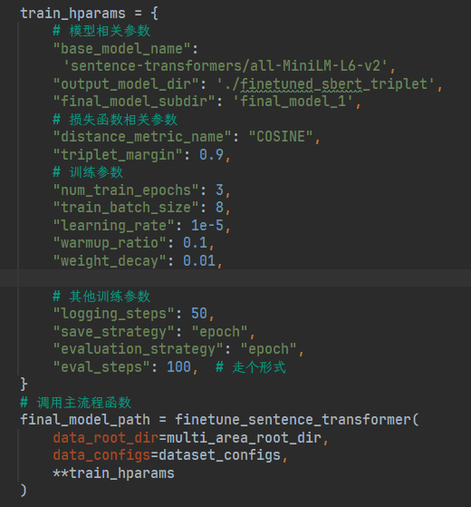

# README

### 一、关键启动文件

#### 1. 知识编辑

* **EasyEdit/run_bishe/run_zzz_multiarea.py**

测试ZZZ在multiarea上的表现。适配了两阶段路由

* **EasyEdit/run_bishe/run_zzz.py**

测试ZZZ在counterfact上的表现。未适配两阶段路由

* **EasyEdit/run_bishe/run_wiser.py**

测试WISE在coutnerfact上的表现。

* **EasyEdit/run_bishe/run_counterfact.py**

比run_wiser更通用的counterfact测试脚本，适配了WISE、GRACE和MEMIT

* **EasyEdit/run_bishe/run_baseline_zzz.py**

测试WISE、GRACE在multiarea上的表现。

#### 2. 训练和测试等

* **EasyEdit/run_bishe/metric_learning.py**

在Multiarea上微调SBERT模型

* **EasyEdit/run_bishe/metric_learning_zsre.py**

在ZsRE上微调SBERT模型。但实际上，SBERT未经微调就能区分locality_inputs和prompt。

* **EasyEdit/run_bishe/multiarea_dataset.py**

用于加载multiarea数据集。

* **EasyEdit/run_bishe/semantic_alignment.py**

从Llama3.2中提取中间层输出

* **EasyEdit/run_bishe/boundary_embedding_test.py**
测试微调后的SBERT模型对counterfact的分类能力

‍

### 二、运行ZZZ

#### 0. 配置运行环境
```python
使用环境：
python3.9
```

在ipynb文件中配置环境代码：

```python
!git clone https://github.com/fasdkljfds/EasyEdit.git
%cd EasyEdit
!pip install -r requirements311.txt
from huggingface_hub import login
login(token='your_huggingface_token')
%cd ..
```

‍

#### 1. 微调SBERT

在指定数据集上微调SBERT。运行metric_learning，超参数硬编码于main代码中的train_hparams字典内，

其中triplet_margin是关键参数，较大的triplet_margin值会导致微调后的SBERT对语义变化极度敏感，甚至丧失部分原本能力，这可能是它在聚类中表现不佳的原因。

微调后，应当把超参数中output_model_dir/final_model_subdir写入hparams/zzz/llama3.2-1b.yaml的boundary_model_name中，以便于程序加载模型。
在本例中，boundary_model_name=./finetuned_sbert_triplet/final_model_1




#### 2. 执行知识编辑

运行**run_zzz_multiarea.py文件。**

启动命令：

```python
!python 'EasyEdit/run_bishe/run_zzz_multiarea.py' --editing_method=ZZZ --hparams_dir=EasyEdit/hparams/ZZZ/llama3.2-1b.yaml --data_dir=EasyEdit/data/output_meta_llama_3_8b_instruct --data_configs=business_industry:10,human_scientist:11,event_sport:11,geography_forest:10,places_landmark:10 --retrain=True --two_stages=True --boundary_threshold=0.5 --boundary_model_name=/kaggle/input/finetuned1/pytorch/default/1/finetuned_sbert_triplet/final_model_1
```

参数说明：

```python
--data_configs 选择加载multiarea数据集中的数据
--retrain 设置为True即可
--two_stages 使用两阶段路由，设置为True即可，会覆盖hparams下的超参数配置
--boundary_threshold 会覆盖超参数配置。对于locality_input和rephrase_prompts，和prompts的余弦相似度超过0.5的认为是不相关问题，低于0.5的认为是相关问题
--boundary_model_name 微调后的SBRET路径，会覆盖hparams下的超参数配置
```

### 三、复现毕设实验
#### 1. 配置运行环境：
```python
!git clone https://github.com/fasdkljfds/EasyEdit.git
%cd EasyEdit
!pip install -r requirements311.txt
from huggingface_hub import login
login(token='your_huggingface_token')
%cd ..
```

#### 2. 测试ZsRE
ZsRE的测试脚本位于run_bishe/ZsRE.py

！！！TSR的boundary_threshold应当设置为0.8

启动命令：

GRACE:
```
!python 'EasyEdit/run_bishe/ZsRE.py' --editing_method=GRACE --hparams_dir=EasyEdit/hparams/GRACE/llama3.2-1b.yaml --data_dir=EasyEdit/data/wise/ZsRE/zsre_mend_edit.json --ds_size=1000 --data_type=ZsRE --evaluation_type=traditional
```

FT:
```
!python 'EasyEdit/run_bishe/ZsRE.py' --editing_method=FT --hparams_dir=EasyEdit/hparams/FT/llama3.2-1b.yaml --data_dir=EasyEdit/data/wise/ZsRE/zsre_mend_edit.json --ds_size=1000 --data_type=ZsRE --evaluation_type=traditional
```

WISE:
```
!python 'EasyEdit/run_bishe/ZsRE.py' --editing_method=WISE --hparams_dir=EasyEdit/hparams/WISE/llama3.2-1b.yaml --data_dir=EasyEdit/data/wise/ZsRE/zsre_mend_edit.json --ds_size=500 --data_type=ZsRE --evaluation_type=traditional
```

ROME:
```
!python 'EasyEdit/run_bishe/ZsRE.py' --editing_method=ROME --hparams_dir=EasyEdit/hparams/ROME/llama3.2-1b.yaml --data_dir=EasyEdit/data/wise/ZsRE/zsre_mend_edit.json --ds_size=1000 --data_type=ZsRE --evaluation_type=traditional
``` 

TSR:
```angular2html
!python 'EasyEdit/run_bishe/ZsRE.py' --editing_method=TSR --hparams_dir=EasyEdit/hparams/ZZZ/llama3.2-1b.yaml --data_dir=EasyEdit/data/wise/ZsRE/zsre_mend_edit.json --data_type=ZsRE --ds_size=1000 --retrain=True --two_stages=True --boundary_threshold=0.5 --boundary_model_name=
```


‍

#### 3. 测试Multiarea
！！！注意，所有实验的data_configs都应该改为ALL:1000，启用平均采样

！！！TSR的boundary_threshold应当设置为0.8

GRACE:
```angular2html
!python 'EasyEdit/run_bishe/run_baseline_zzz.py' --editing_method=GRACE --hparams_dir=EasyEdit/hparams/GRACE/llama3.2-1b.yaml --data_dir=EasyEdit/data/output_meta_llama_3_8b_instruct --data_configs=business_industry:1,human_scientist:0,event_sport:0,geography_forest:0,places_landmark:0
```

FT:
```
!python 'EasyEdit/run_bishe/run_baseline_zzz.py' --editing_method=FT --hparams_dir=EasyEdit/hparams/FT/llama3.2-1b.yaml --data_dir=EasyEdit/data/output_meta_llama_3_8b_instruct --data_configs=business_industry:1,human_scientist:0,event_sport:0,geography_forest:0,places_landmark:0
```


WISE:
```angular2html
!python 'EasyEdit/run_bishe/run_baseline_zzz.py' --editing_method=WISE --hparams_dir=EasyEdit/hparams/WISE/llama3.2-1b.yaml --data_dir=EasyEdit/data/output_meta_llama_3_8b_instruct --data_configs=ALL:300
```

ROME:
```angular2html
!python 'EasyEdit/run_bishe/run_baseline_zzz.py' --editing_method=ROME --hparams_dir=EasyEdit/hparams/ROME/llama3.2-1b.yaml --data_dir=EasyEdit/data/output_meta_llama_3_8b_instruct --data_configs=business_industry:1,human_scientist:0,event_sport:0,geography_forest:0,places_landmark:0
```

TSR:
```angular2html
!python 'EasyEdit/run_bishe/run_zzz_multiarea.py' --editing_method=TSR --hparams_dir=EasyEdit/hparams/ZZZ/llama3.2-1b.yaml --data_dir=EasyEdit/data/output_meta_llama_3_8b_instruct --data_configs=business_industry:10,human_scientist:10,event_sport:11,geography_forest:10,places_landmark:10 --retrain=True --two_stages=True --boundary_threshold=0.5 --boundary_model_name=
```
#### 4. 测试CKnowEdit

！！！CKnowEdit的采样逻辑直接实现在run_bishe/CKnowEdit.py里，采样逻辑和MultiArea一致

GRACE:
```
!python 'EasyEdit/run_bishe/CKnowEdit.py' --editing_method=GRACE --hparams_dir=EasyEdit/hparams/GRACE/qwen2.5-1b.yaml --data_dir=EasyEdit/data/CKnowEdit --ds_size=60
```

FT:
```angular2html
!python 'EasyEdit/run_bishe/CKnowEdit.py' --editing_method=FT --hparams_dir=EasyEdit/hparams/FT/qwen2.5-1b.yaml --data_dir=EasyEdit/data/CKnowEdit --ds_size=60
```

WISE:
```angular2html
!python 'EasyEdit/run_bishe/CKnowEdit.py' --editing_method=WISE --hparams_dir=EasyEdit/hparams/WISE/qwen2.5-1b.yaml --data_dir=EasyEdit/data/CKnowEdit --ds_size=60
```

ROME:
```angular2html
!python 'EasyEdit/run_bishe/CKnowEdit.py' --editing_method=ROME --hparams_dir=EasyEdit/hparams/ROME/qwen2.5-1b.yaml --data_dir=EasyEdit/data/CKnowEdit --ds_size=60
```

TSR:
```angular2html
!python 'EasyEdit/run_bishe/CKnowEdit.py' --editing_method=TSR --hparams_dir=EasyEdit/hparams/ZZZ/qwen2.5-1b.yaml --data_dir=EasyEdit/data/CKnowEdit --ds_size=60 --retrain=True --two_stages=False --boundary_threshold=0.7
```
#### 5. 消融实验

没有语义路由:
```angular2html
!python 'EasyEdit/run_bishe/run_zzz_multiarea.py' --editing_method=ZZZ --hparams_dir=EasyEdit/hparams/ZZZ/llama3.2-1b.yaml --data_dir=EasyEdit/data/output_meta_llama_3_8b_instruct --data_configs=business_industry:11,human_scientist:11,event_sport:11,geography_forest:11,places_landmark:11 --retrain=True --two_stages=False --boundary_threshold=0.5 --boundary_model_name=123     
```
没有领域路由:
```angular2html
!python 'EasyEdit/run_bishe/run_zzz_multiarea.py' --editing_method=ZZZ --hparams_dir=EasyEdit/hparams/ZZZ/llama3.2-1b.yaml --data_dir=EasyEdit/data/output_meta_llama_3_8b_instruct --data_configs=business_industry:11,human_scientist:11,event_sport:11,geography_forest:11,places_landmark:11 --retrain=True --two_stages=True --boundary_threshold=0.85 --boundary_model_name=/kaggle/input/ft_0.9/pytorch/default/1/final_model_1 --use_multi_ffn=False
```

#### 6. CounterFact测试代码

！！！未经完全测试，可能无法运行
GRACE:
```
!python 'EasyEdit/run_bishe/CounterFact.py' --editing_method=GRACE --hparams_dir=EasyEdit/hparams/GRACE/llama3.2-1b.yaml --data_dir=EasyEdit/data/KnowEdit/benchmark_wiki_counterfact_train_cf.json --ds_size=60 --data_type=counterfact --evaluation_type=traditional
```
FT:
```angular2html
!python 'EasyEdit/run_bishe/CounterFact.py' --editing_method=FT --hparams_dir=EasyEdit/hparams/FT/llama3.2-1b.yaml --data_dir=EasyEdit/data/KnowEdit/benchmark_wiki_counterfact_train_cf.json --ds_size=60 --data_type=counterfact --evaluation_type=traditional
```
WISE:
```angular2html
!python 'EasyEdit/run_bishe/CounterFact.py' --editing_method=WISE --hparams_dir=EasyEdit/hparams/WISE/llama3.2-1b.yaml --data_dir=EasyEdit/data/KnowEdit/benchmark_wiki_counterfact_train_cf.json --ds_size=1 --data_type=counterfact --evaluation_type=traditional

```
ROME:
```
!python 'EasyEdit/run_bishe/CounterFact.py' --editing_method=ROME --hparams_dir=EasyEdit/hparams/ROME/llama3.2-1b.yaml --data_dir=EasyEdit/data/KnowEdit/benchmark_wiki_counterfact_train_cf.json --ds_size=60 --data_type=counterfact --evaluation_type=traditional
```
TSR:
```angular2html
!python 'EasyEdit/run_bishe/CounterFact.py' --editing_method=TSR --hparams_dir=EasyEdit/hparams/ZZZ/llama3.2-1b.yaml --data_dir=EasyEdit/data/KnowEdit/benchmark_wiki_counterfact_train_cf.json --ds_size=60 --data_type=counterfact --retrain=True --two_stages=True --boundary_threshold=0.7 --boundary_model_name=
```